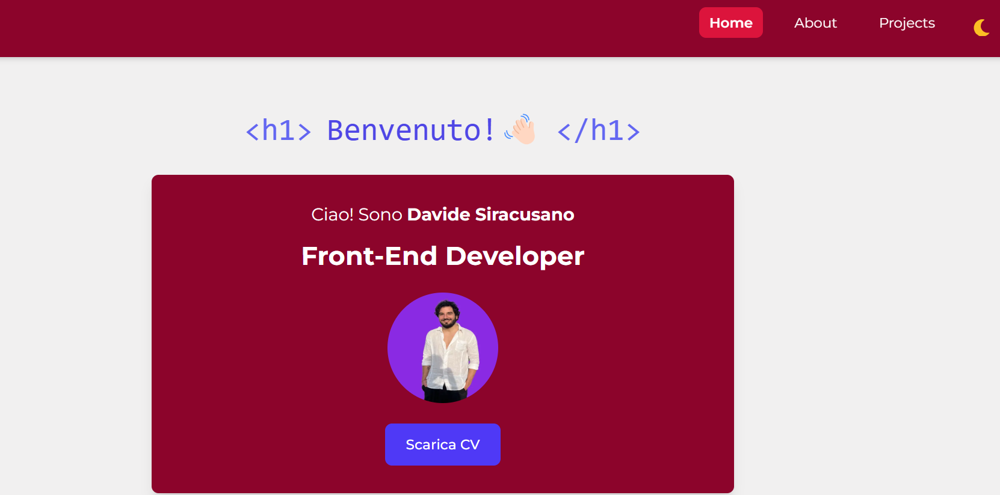

# Portfolio di Davide Siracusano - Front-End Developer



## 🎯 Chi Sono

Ciao! Sono Davide Siracusano, un Front-End Developer appassionato di sviluppo web e UI/UX design. Mi piace trasformare idee in esperienze digitali intuitive, curando ogni dettaglio del codice e del design. Il mio approccio si basa su tre pilastri fondamentali: collaborazione, chiarezza e accessibilità.

## �️ Tecnologie Utilizzate

- **Next.js** - Framework React per applicazioni web moderne e performanti
- **Tailwind CSS** - Per uno styling efficiente e un design system coerente
- **Framer Motion** - Per animazioni fluide e interazioni dinamiche
- **React Icons** - Per un'interfaccia ricca di icone intuitive
- **TypeScript** - Per un codice robusto e ben tipizzato
- **Git & GitHub** - Per il controllo versione e la collaborazione

---

## 🎨 Caratteristiche Principali

- **Design Moderno**: Interfaccia ispirata a VS Code con tema chiaro/scuro
- **Animazioni Fluide**: Transizioni ed effetti per una UX coinvolgente
- **Responsive Design**: Ottimizzato per ogni dispositivo
- **Sezioni Organizzate**:
  - 🏠 **Home**: Presentazione e overview delle competenze
  - 👨‍💻 **About**: Il mio percorso e la mia filosofia di sviluppo
  - 🛠️ **Projects**: Showcase dei progetti realizzati
  - 📊 **Skills**: Competenze tecniche con indicatori di livello
  - 📬 **Contatti**: Form per collaborazioni e opportunità
 
## Link: https://davide-siracusano-portfolio.vercel.app/

## 💻 Sviluppo Locale

```bash
# Clona il repository
git clone https://github.com/DavideSiracusano/davide-siracusano-portfolio.git

# Installa le dipendenze
npm install

# Avvia il server di sviluppo
npm run dev
```

## 📱 Responsive Design

Il portfolio è completamente responsive e ottimizzato per:

- 📱 Mobile (< 640px)
- 📱 Tablet (640px - 1024px)
- 🖥️ Desktop (> 1024px)

## 📫 Contatti

- 📧 Email: [davidesiracusano1995@gmail.com]
- 💼 LinkedIn: [Davide Siracusano]
- 🐱 GitHub: [@DavideSiracusano]

## 📄 Licenza

MIT © 2023 Davide Siracusano

---

## 📂 Struttura del progetto

/portfolio
├─ /app
│ ├─ /components
│ │ ├─ Header.jsx
│ │ ├─ Footer.jsx
│ │ ├─ DarkTheme.jsx
│ │ └─ Main.jsx
│ ├─ /pages
│ │ ├─ index.jsx
│ │ ├─ about.jsx
│ │ └─ projects.jsx
│ └─ globals.css
├─ /imgs
│ └─ loghi, mockup progetti, immagini varie
├─ package.json
└─ README.md

yaml
Copia codice

---

## 📌 Come eseguire il progetto in locale

1. **Clona il repository**:

```bash
git clone https://github.com/DavideSiracusano/portfolio.git
cd portfolio
Installa le dipendenze:

bash
Copia codice
npm install
Avvia l’ambiente di sviluppo:

bash
Copia codice
npm run dev
Apri il browser su http://localhost:3000

💻 Progetti inclusi
Anime World – App per cercare e scoprire anime.

Yu-Gi-Oh Database – Database di carte Yu-Gi-Oh con filtri e ricerca.

Movies Selection – Selezione e scoperta di film tramite API.

React Pokedex – Pokedex interattivo in React.

React To-do List – Gestione attività con React.

Javascript Advanced – Progetto avanzato di JavaScript del master Start2Impact.

Fullstack Project Frontend – Frontend Angular per progetto fullstack.

Fullstack Project Backend – Backend Node.js/Express per progetto fullstack.
```
